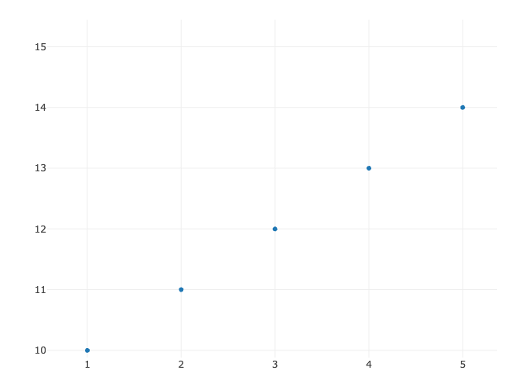
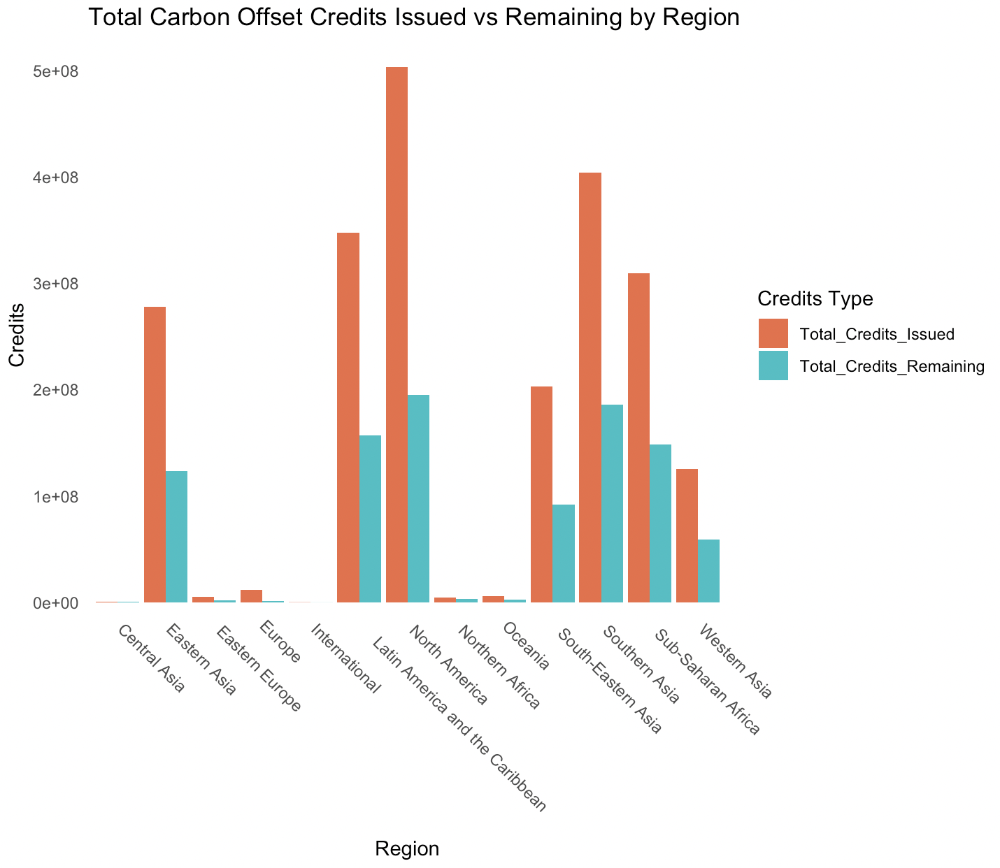
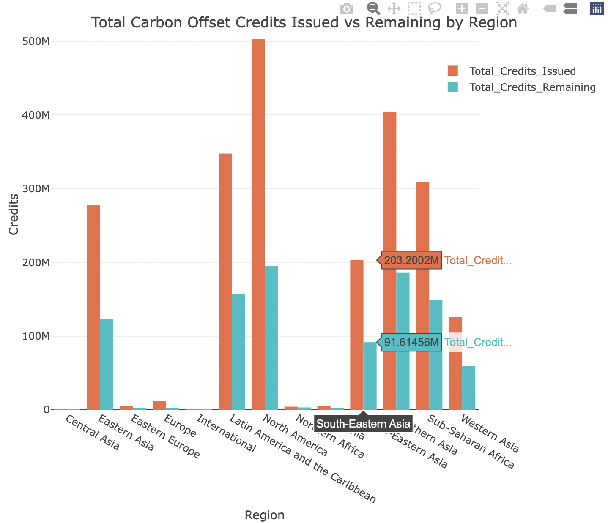
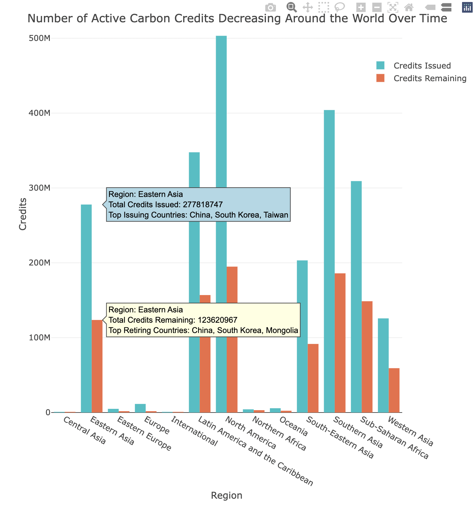

<center></center>

# Creating Interactive Plots with Plotly

------------------------------------------------------------------------

### Tutorial Aims

#### <a href="#section1">1. Introduction to Plotly</a>

#### <a href="#section2">2. Understand the basics of Plotly and its key features</a>

#### <a href="#section3">3. Create basic interactive plots using Plotly in R features</a>

------------------------------------------------------------------------

<a name="section1"></a>

## 1. Introduction to Plotly

Plotly is a free, open-source, and powerful graphing library that enables users to create beautiful, interactive, and responsive plots. Unlike static visualizations in `ggplot2`, Plotly visualizations are imbued with dynamic features, such as zoom, pan, and hover, making them especially useful for dashboards, reports, or publication-quality graph-making.

### The company behind Plotly

The Plotly library is one of the many Data Visualisation Library products offered by Plotly, a technical computing company headquartered in Montreal, Quebec. Founded by Alex Johnson, Jack Parmer, Chris Parmer, and Matthew Sundquist. It provides graphing libraries for multiple languages, including R, Python, MATLAB, and JavaScript, along with analytics and collaborative tools. Plotly is popular in data science and machine learning because it making visual analysis both engaging and insightful.

### Equipping ourselves with the "Plotly prowess"

In this tutorial, we will focus on how to use Plotly's R graphing library to create interactive plots that will enhance your data visualization capabilities. By the end of this tutorial, you will be able to build and customize interactive charts that can be used for both exploratory data analysis and presentation purposes.

<a name="section2"></a>

## 2. Understand the basics of Plotly and its key features

In this section, we will create our first basic interactive plot using Plotly in R. Let's start by installing the `plotly` package if you haven't done so yet (we can't really do anything without it):

``` r
# OPTION 1: Install plotly package from CRAN
install.packages("plotly")

# OPTION 2: Install the latest development version of plotly from GitHub via the devtools R package (preferred option):
devtools::install_github("ropensci/plotly")

# Load the library
library(plotly)
```

Easy peasy lemon squeezy; it's as simple as that! Now, time for some magic — let's start creating our first interactive plot. Let's generate a simple scatter plot:

``` r
# Create some example data
x <- c(1, 2, 3, 4, 5)
y <- c(10, 11, 12, 13, 14)

# Create an interactive scatter plot
plot_ly(x = x, y = y, type = 'scatter', mode = 'markers')
```

When you run this code, an interactive plot will appear in the Viewer pane of RStudio. A little something like this:

<center></center>

Upon hovering your mouse at the top-right corner of the generated plot, you will notice a select number of icons. These tools makes this an interactive scatter plot, where you can zoom, pan, and hover over data points to see their values.

<center></center>

In order (from left to right),

-   **Camera:** Downloads the plot as a PNG image; Allows you to save your interactive plot for use in presentations or reports.
-   **Magnifying Glass:** Enables the zoom function; Drag your mouse to create a box over a section of the plot you want to zoom in on for a closer view.
-   **All-rounder Arrow:** Allows you to drag and pan the entire plot in all directions to explore different areas of the plot, providing a flexible way to navigate.
-   **Dotted Square:** Box select; Drag a box to select a region within the plot. Often used for filtering or highlighting specific data points within the selected area.
-   **Dotted Lasso:** Lasso select; draw a freeform selection to highlight specific data points.
-   **Plus:** Zooms in on the plot.
-   **Minus:** Zooms out of the plot.
-   **Diagonal All-rounder Arrow:** Resizes the plot by dragging the corners, making it bigger or smaller. Can be helpful when you need to make the plot fit into specific spaces on the screen or in a presentation.
-   **House:** Resets the view to the original default.

<a name="section3"></a>

## 3. Create basic interactive plots using Plotly in R.

Now that we've learned the fundamentals, let's pull up our big boy/girl socks and apply the knowledge to an actual dataset. For this, we'll use a real-world dataset from the [Berkeley Carbon Trading Project](https://gspp.berkeley.edu/research-and-impact/centers/cepp/projects/berkeley-carbon-trading-project). This dataset contains all carbon offset projects, credit issuances, and credit retirements listed globally by four major voluntary offset project registries—American Carbon Registry (ACR), Climate Action Reserve (CAR), Gold Standard, and Verra (VCS).

Download the dataset here: [Voluntary Registery Offsets Database v2024-10](https://gspp.berkeley.edu/assets/uploads/page/Voluntary-Registry-Offsets-Database--v2024-10.xlsx)

**TO NOTE with regards to data loading and cleaning:**

-   The dataset is in `.xlsx` format, we need to load it using the `readxl` package.

-   The dataset is large and contains many columns, so we’ll focus only on the relevant sections for our analysis. *(**C02offset_general***: *Contains general information about visible carbon offset projects.)*

``` r
# Load required libraries
library(readxl)
library(dplyr)
library(ggplot2)
library(plotly)

# Load the dataset from the "PROJECTS" sheet, skipping the first three rows (metadata)
carbon_data <- read_excel("path/to/your/berkeley_carbon_trading_data.xlsx", sheet = "PROJECTS", skip = 3)

# Remove carriage return (\r) and newline (\n) characters from column names
colnames(carbon_data) <- gsub("[\r\n]", "", colnames(carbon_data))

# Create the dataset (columns A to W)
C02offset_general <- carbon_data[, 1:23]

# Inspect and clean the data
colnames(C02offset_general)   # Check the column names
head(C02offset_general)       # View the first few rows of the data
```

Now that we've cleaned the data and focused on the relevant information, we can move on to the exciting part: creating visualizations to explore the trends in carbon offset projects.

We will create both a `ggplot` and a `plotly` bar chart to show the same data, which will allow us to compare the features of static and interactive plots. While `ggplot` provides a simple and aesthetically pleasing static visualization, `plotly` offers dynamic interactivity that can enhance user engagement with the data. Let's dive into both methods!

Some logistics first...

``` r
# Select variable columns to plot
# E.g. Summarizing the data by Region, Total Credits Issued, and Total Credits Remaining
region_summary <- C02offset_general %>%
  # Remove rows with missing values in 'Total Credits Issued' and 'Total Credits Remaining'
  filter(!is.na(`Total Credits Issued`) & !is.na(`Total Credits Remaining`)) %>%
  group_by(Region) %>%
  # Sum up 'Total Credits Issued' and 'Total Credits Remaining' for each region
  summarise(
    Total_Credits_Issued = sum(`Total Credits Issued`, na.rm = TRUE),
    Total_Credits_Remaining = sum(`Total Credits Remaining`, na.rm = TRUE)
  )

# Reshape the data to long format for both ggplot and plotly
region_summary_long <- region_summary %>%
  pivot_longer(cols = c(Total_Credits_Issued, Total_Credits_Remaining),
               names_to = "Credit_Type",
               values_to = "Credits")

# Define a colour palette to use for both plots
colour_palette <- c('Total_Credits_Issued' = '#F06B44', 'Total_Credits_Remaining' = '#17C0C5')
```

Plotting the ggplot:

``` r
# ---- Normal ggplot bar chart (non-interactive) ----
gg_plot <- ggplot(region_summary_long, aes(x = Region, y = Credits, fill = Credit_Type)) +
  geom_bar(stat = "identity", position = "dodge") +  # Side by side bars
  scale_fill_manual(values = colour_palette) +  # Apply custom color palette
  theme_minimal() +  
  theme(panel.grid = element_blank(), # A. Remove grid lines
        axis.text.x = element_text(angle = 315, hjust = -0.125)) +  # B. Rotate x-axis labels
  labs(
    title = 'Total Carbon Offset Credits Issued vs Remaining by Region',
    x = 'Region',
    y = 'Credits',
    fill = 'Credits Type'
  )
gg_plot
```

<center></center>

Plotting the plotly plot:

``` r
# ---- Interactive plotly bar chart ----
plotly_plot <- plot_ly(region_summary_long, x = ~Region, y = ~Credits, color = ~Credit_Type, type = 'bar', colors = colour_palette) %>%
  layout(
    title = 'Total Carbon Offset Credits Issued vs Remaining by Region',
    xaxis = list(title = 'Region'),
    yaxis = list(title = 'Credits'),
    barmode = 'group'
  )
plotly_plot
```

<center></center>

Let's take a closer look at both plots with a critical eye...

### Probing Questions on the Differences Between ggplot and Plotly

1.  **Code Length**:

-   Which code is longer and why? When looking at the comments A and B, why do these need to be added manually in the ggplot version but not in Plotly? What does this tell us about the two libraries' approach to plotting?

2.  **Customization**:

-   What are the key differences in customization options between ggplot and Plotly? Which library provides more control over the aesthetics of the plot, and why?

3.  **Language Differences**:

-   Notice any difference in the commands needed to perform the same function? For example, compare `labs()` in ggplot with `layout()` in Plotly. How do the two libraries handle bar color customization? Which library feels more intuitive *overall*?

4.  **Usability**:

-   Which of the two libraries is easier to use for beginners? Are there any challenges a more advanced user might face with either library?

5.  **Accessibility**:

-   Which chart is more accessible in terms of sharing or embedding in web applications? How do the two libraries compare when it comes to making plots easy to share online?

6.  **Interactivity**:

-   How does the interactivity of the Plotly chart compare to the static nature of the ggplot chart? What benefits do interactive charts offer for data exploration and presentation?

### Customized Hover Information

One of Plotly's standout features is the ability to customize hover information to display additional data or metrics interactively. This feature is particularly useful for understanding patterns without cluttering the visual layout. Users simply need to hover their mouse over data points of interest to access deeper insights.

Let's say in this example we wanted to provide additional details like the top three countries contributing to carbon credit issuance and retirement for each region to demonstrate how to make hover integration more insightful. Let us extract this information out of our raw data first.

``` r
# Pre-processing data to extract information needed for hover customization
# Identify the top 3 countries by total credits issued for each region
top_countries_issued <- C02offset_general %>%
  group_by(Region, Country) %>%
  summarise(Total_Credits_Issued = sum(`Total Credits Issued`, na.rm = TRUE)) %>%
  arrange(Region, desc(Total_Credits_Issued)) %>%
  group_by(Region) %>%
  slice_head(n = 3) %>%
  summarise(Top_Countries_Issued = paste(Country, collapse = ", "))

# Identify the top 3 countries by total credits retired for each region
top_countries_retired <- C02offset_general %>%
  group_by(Region, Country) %>%
  summarise(Total_Credits_Retired = sum(`Total Credits Remaining`, na.rm = TRUE)) %>%
  arrange(Region, desc(Total_Credits_Retired)) %>%
  group_by(Region) %>%
  slice_head(n = 3) %>%
  summarise(Top_Countries_Retired = paste(Country, collapse = ", "))

# Merge the top countries information back with the summarized regional data
region_summary <- region_summary %>%
  left_join(top_countries_issued, by = "Region") %>%
  left_join(top_countries_retired, by = "Region")
```

The `Top_Credits_Issued` and `Top_Credits_Retired` dataframes identifies the top 3 countries for carbon credits issued and retired in each region respectively, concatenating them into a string for display.

A specific function is now needed to tailor hover information to each credit type:

-   `add_trace`: Adds additional data layers or traces to a plot, representing multiple categories, datasets or aspects of data.

The following functions can then be used to customize hover information:

-   `hoverinfo`& `text`: Generates and controls what hover information is shown. Here we will be combining region data with the calculated top countries.
-   `hoverlabel`: Adjusts the appearance of the hover text. You can further adjust the font size, background color, or even the position of the hover text outside the bars by playing with these settings.

Applying all these functions to our example would give us:

``` r
# Create the Plotly bar chart with hover customization
# Define a color palette
colour_palette <- c('Credits Issued' = '#17C0C5', 'Credits Remaining' = '#F06B44')

plotly_plot_hover <- plot_ly(region_summary, x = ~Region, y = ~Total_Credits_Issued, type = 'bar',
                       name = 'Credits Issued', marker = list(color = colour_palette["Credits Issued"]),
                       # Customize hover information
                       hoverinfo = "text",
                       # Define hover text to show additional details
                       text = ~paste("Region:", Region,
                                     "<br>Total Credits Issued:", Total_Credits_Issued,
                                     "<br>Top Issuing Countries:", Top_Countries_Issued),
                       # Customer appearance of hover information
                       hoverlabel = list(bgcolor = "lightblue", font = list(size = 12, color = "black")), 
                       # Disable text display for the bars.ensure that text only appears when hovering over the bars and not by default.
                       textposition = "none") %>%
  # Add another trace for 'Credits Remaining'
  add_trace(y = ~Total_Credits_Remaining, name = 'Credits Remaining',
            marker = list(color = colour_palette["Credits Remaining"]),
            hoverinfo = "text",
            text = ~paste("Region:", Region,
                          "<br>Total Credits Remaining:", Total_Credits_Remaining,
                          "<br>Top Retiring Countries:", Top_Countries_Retired),
            hoverlabel = list(bgcolor = "lightyellow", font = list(size = 12, color = "black")),
            textposition = "none") %>%
  layout(
    title = 'Number of Active Carbon Credits Decreasing Around the World Over Time',
    xaxis = list(title = 'Region'),
    yaxis = list(title = 'Credits'),
    barmode = 'group'
  )

plotly_plot_hover
```

You will notice that when hovering over the bars representing total credits issued, users can view the key issuing countries, whereas while hovering over the credits remaining provides information on the top retiring countries.

<center></center>

By providing tailored details based on credit type, we offer deeper insights into regional trends. This kind of context-specific information enriches the visualization, making it highly interactive and tailored for detailed data exploration.

## Furthering your journey in using Plotly

This tutorial introduced the powerful features of Plotly for crafting interactive plots in R. By leveraging these tools, you can create visually engaging and dynamic visualizations that enhance data exploration and communication.

Don't let your journey end here, the fun has just begun! Plotly offers a variety of ways to enhance your visualizations. Here are some options to explore further:

-   **Explore Other Types of Charts:** Try creating different types of visualizations, such as scatter plots, line charts, or spatial maps.

    -   `plot_ly(type = ...)`: Define the chart type (e.g., 'scatter', 'bar', 'line', 'mapbox').

    -   `add_trace()`: Add layers to your chart, enabling multi-type visualizations.

    -   [Cheatsheet for plotting different types of charts on plotly](https://images.plot.ly/plotly-documentation/images/r_cheat_sheet.pdf)

-   **Animations and Sliders:** Add animations to show changes over time, and use sliders to dynamically explore subsets of data. This is especially useful for time-series data or categorical comparisons.

    -   `animation_frame`: Specify the variable for animation across time or categories.

    -   `animation_group`: Ensure continuity of data points across frames.

    -   `transition = list(...)`: Control the animation speed and easing behavior.

    -   `frame = list(duration = ...)`: Customize frame durations for smoother animations.

    -   `slider = list(...)`: Add sliders to dynamically filter data subsets.

-   **Linked Brushing:** Create dashboards where interactions with one plot can highlight related data in another plot, enhancing the ability to explore interconnected datasets.

    -   `subplot()`: Combine multiple plots into one view.

    -   `highlight()`: Link plots for interactive filtering and highlighting across charts.

By experimenting with these features, you can make your data more engaging and insightful for your audience. [Learn more here!](https://plotly.com/r/)


